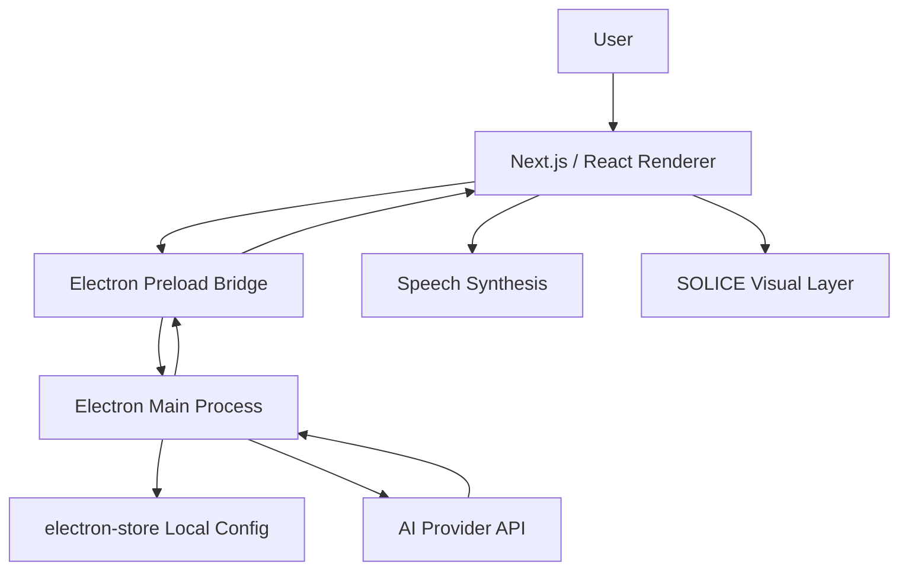

# SOLICE Desktop Assistant

<p align="center">
  
</p>

<p align="center">
  <strong>A soft-spoken desktop AI companion built with Electron, Next.js, React, and bring-your-own-model AI providers.</strong>
</p>

<p align="center">
  
  
  
  
</p>

---

## What Is SOLICE?

SOLICE is a desktop AI assistant with a futuristic disk-like personality. It is designed to be summoned with a keyboard shortcut, appear inside a polished desktop window, chat naturally with the user, speak replies aloud, and eventually hover above the screen to help analyze what the user is looking at.

The goal is simple: **help people think, create, study, troubleshoot, and get unstuck without feeling like they are talking to a cold command box.**

SOLICE should feel:

- Kind, helpful, and friendly.
- Smart, concise, and practical.
- Funny in small doses.
- Cool and soft-spoken.
- Slightly sarcastic when it fits.
- Like a tiny companion living inside the monitor.

---

## Current Features

| Feature | Status | Notes |
| --- | --- | --- |
| Desktop app shell | Available | Runs through Electron with a native desktop window. |
| Global summon shortcut | Available | `CommandOrControl+Shift+Space` toggles the SOLICE window. |
| Text chat | Available | Users can type messages and receive AI responses. |
| AI provider setup | Available | Choose a provider, model, API key, and custom base URL from the setup screen. |
| Multi-provider support | Available | Gemini, OpenAI, Claude, DeepSeek, and custom OpenAI-compatible providers. |
| Chat history | Available | Conversation history is saved locally with `electron-store`. |
| Clear chat | Available | Settings controls can clear the stored conversation. |
| Forget API key | Available | Settings controls can remove the saved provider key. |
| Voice output | Available | Uses browser `speechSynthesis` to read SOLICE replies aloud. |
| Animated SOLICE visual | Available | The assistant visual pulses differently while idle, thinking, or speaking. |
| Local-first configuration | Available | Provider settings stay on the user's machine. |

---

## Planned Features

| Feature | Priority | Direction |
| --- | --- | --- |
| True 3D cursor-facing SOLICE model | High | Turn the disk into a more responsive 3D/tilt object that follows the user's mouse cursor. |
| Image chat | High | Let users attach images and ask SOLICE to describe, inspect, or reason about them. |
| Voice chat input | High | Add microphone recording and speech-to-text so users can talk to SOLICE naturally. |
| Notes | Medium | Let SOLICE save quick notes locally. |
| Timers and reminders | Medium | Add lightweight productivity tools that can be triggered through chat. |
| Chat creation and deletion | Medium | Support multiple conversations instead of one saved history stream. |
| Video chat | Future | Add richer multimodal conversations using camera or video frames. |
| Overlay screen analysis | Future | A Cluely-style always-on-top assistant overlay that can inspect selected screen context with explicit user permission. |

### Overlay Screen Analysis Vision

The overlay mode is planned as a translucent, borderless assistant layer that floats above the user's desktop. SOLICE would sit near the top of the overlay, accept typed or spoken questions, and analyze a user-approved screenshot or selected screen region.

Privacy should be central to this feature:

- Screen analysis must be opt-in.
- SOLICE should clearly show when screen context is being captured.
- Users should be able to stop sharing instantly.
- Captured context should only be sent to the selected AI provider when the user asks for analysis.

---

## Tech Stack

- **Electron** - native desktop shell, global shortcut, local storage, IPC bridge.
- **Next.js** - renderer application and static export target.
- **React** - UI state, chat interface, setup screen, voice state.
- **TypeScript** - app and bridge types.
- **Tailwind CSS** - styling system.
- **electron-store** - local config and chat history persistence.
- **Web Speech API** - spoken SOLICE replies.

---

## Architecture



The renderer never talks directly to Node APIs. It calls `window.solice`, which is exposed by `electron/preload.js`. The main process handles provider requests, shortcut registration, local storage, and chat history.

---

## Project Structure

```text
.
|-- electron/
|   |-- main.js              # Electron lifecycle, shortcut, local store, AI provider requests
|   `-- preload.js           # Secure IPC bridge exposed as window.solice
|-- scripts/
|   `-- run-electron.js      # Electron launcher helper
|-- src/
|   |-- app/
|   |   |-- layout.tsx       # App metadata and shell layout
|   |   `-- page.tsx         # Main SOLICE app state and setup/chat routing
|   |-- components/
|   |   |-- ChatInterface.tsx
|   |   |-- SetupScreen.tsx
|   |   |-- SoliceFace.tsx
|   |   `-- VoiceEngine.tsx
|   |-- styles/
|   |   `-- globals.css
|   `-- types/
|       `-- solice.d.ts      # Shared SOLICE app and bridge types
|-- PUBLIC/
|   `-- ASSETS/              # SOLICE visual assets and references
|-- package.json
`-- PLANS.MD                 # Extra planning notes and visual direction
```

---

## Getting Started

### Prerequisites

- Node.js
- npm
- An API key from your preferred AI provider

### Install

```bash
npm install
```

### Run In Development

```bash
npm run dev
```

This starts the Next.js renderer on `http://127.0.0.1:3000` and opens the Electron app after the renderer is ready.

### Build

```bash
npm run build
```

### Start Built App

```bash
npm run start
```

### Quality Checks

```bash
npm run lint
npm run typecheck
```

---

## Using Your Own API Key

SOLICE is designed around a **bring your own key** workflow. On first launch, the setup screen lets you choose a provider, enter a model, and save an API key locally.

Supported provider options:

| Provider | Default Model | Notes |
| --- | --- | --- |
| Gemini | `gemini-2.5-flash` | Uses the Gemini `generateContent` endpoint. |
| OpenAI | `gpt-4o` | Uses the OpenAI-compatible chat completions format. |
| Claude | `claude-3-opus-20240229` | Uses Anthropic Messages API. |
| DeepSeek | `deepseek-chat` | Uses chat completions with DeepSeek-specific options. |
| Custom | Custom | For OpenAI-compatible APIs such as OpenRouter, Groq, local gateways, or self-hosted model routers. |

Provider keys and settings are stored locally with `electron-store`.

Security note: do not commit real API keys. For local development, prefer the setup screen or pass a temporary `SOLICE_API_KEY` environment variable.

---

## Using A Custom AI Model

If your provider supports an OpenAI-compatible `/chat/completions` API, you can use the **Custom** option from the setup screen.

Example custom configuration:

```text
Provider: Custom
Base URL: https://openrouter.ai/api/v1
Model: google/gemma-4-31b-it:free
API Key: your-provider-key
```

Another example:

```text
Provider: Custom
Base URL: https://api.groq.com/openai/v1
Model: llama3-8b-8192
API Key: your-provider-key
```

SOLICE automatically appends `/chat/completions` when the base URL does not already end with that path.

---

## Adding A New Provider In Code

Use the Custom provider first when possible. If the provider needs special headers or a different request body, add first-class support in these files.

### 1. Add the provider type

Update `src/types/solice.d.ts`:

```ts
export type SoliceProviderId =
  | "gemini"
  | "openai"
  | "anthropic"
  | "deepseek"
  | "custom"
  | "yourProvider";
```

### 2. Register provider metadata

Update `PROVIDERS` in `electron/main.js`:

```js
yourProvider: {
  id: "yourProvider",
  label: "Your Provider",
  defaultModel: "your-model-id",
  baseUrl: "https://api.your-provider.com/v1",
  apiKeyUrl: "https://your-provider.com/keys",
},
```

### 3. Show it in setup

Add the provider to `providerOptions` in `src/components/SetupScreen.tsx`:

```ts
{
  id: "yourProvider",
  label: "Your Provider",
  defaultModel: "your-model-id",
  apiKeyUrl: "https://your-provider.com/keys",
  baseUrl: "",
  keyPlaceholder: "your-key-prefix...",
}
```

### 4. Add a request function if needed

If the provider is not OpenAI-compatible, add a function in `electron/main.js`:

```js
async function requestYourProvider(config, messages) {
  const response = await fetch(`${normalizeBaseUrl(config.baseUrl)}/your-endpoint`, {
    method: "POST",
    headers: {
      Authorization: `Bearer ${config.apiKey}`,
      "Content-Type": "application/json",
    },
    body: JSON.stringify({
      model: config.model,
      messages: toChatMessages(messages),
    }),
  });

  const data = await parseJsonResponse(response);

  if (!response.ok) {
    throw new Error(formatApiError(config, response.status, data));
  }

  return {
    text: data.output_text || data.choices?.[0]?.message?.content || "",
  };
}
```

Then route it in `requestLlm`:

```js
if (config.provider === "yourProvider") {
  return requestYourProvider(config, messages);
}
```

---

## SOLICE Personality Prompt

The main personality is defined in `electron/main.js` as `SOLICE_SYSTEM_PROMPT`.

Core behavior:

- Speak as SOLICE, a small sentient assistant inside the monitor.
- Be warm, loyal, cheerful, smart, and lightly sarcastic.
- Keep responses short unless detail is requested.
- Use occasional mechanical sounds like `[Beep]`, `[Whir]`, or `[Processing...]`.
- Help with tasks, questions, notes, reminders, and creative thinking.
- Never claim screen vision unless the app has provided screen context.

---

## Local Data

SOLICE stores provider configuration and chat history through `electron-store`.

Typical storage locations:

| OS | Location |
| --- | --- |
| Windows | `%APPDATA%/SOLICE-desktop-assistant/config.json` |
| macOS | `~/Library/Application Support/SOLICE-desktop-assistant/config.json` |
| Linux | `~/.config/SOLICE-desktop-assistant/config.json` |

---

## Design Direction

SOLICE should feel minimal, cinematic, and calm:

- Pitch black desktop surface.
- Soft blue edge lighting.
- Glass-like controls where useful.
- Centered SOLICE disk visual.
- Subtle pulsing while idle.
- Stronger pulse while thinking or speaking.
- Chat that stays quiet and does not overpower the character.

The long-term visual goal is a donut-like 3D disk that subtly turns toward the user's cursor and feels alive without becoming distracting.

---

## Development Notes

- `electron/main.js` owns AI provider requests, history persistence, config, and shortcut behavior.
- `electron/preload.js` exposes the safe `window.solice` API to the renderer.
- `src/app/page.tsx` decides whether to show setup or the main assistant.
- `src/components/ChatInterface.tsx` handles typing, message rendering, and settings actions.
- `src/components/VoiceEngine.tsx` speaks assistant replies through `speechSynthesis`.
- `src/components/SoliceFace.tsx` displays and animates the SOLICE visual layer.

---

## License

No license has been selected yet. Add one before publishing or accepting external contributions.
